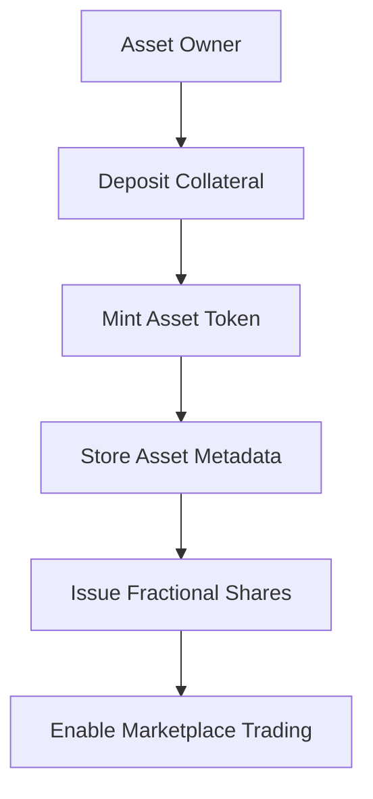
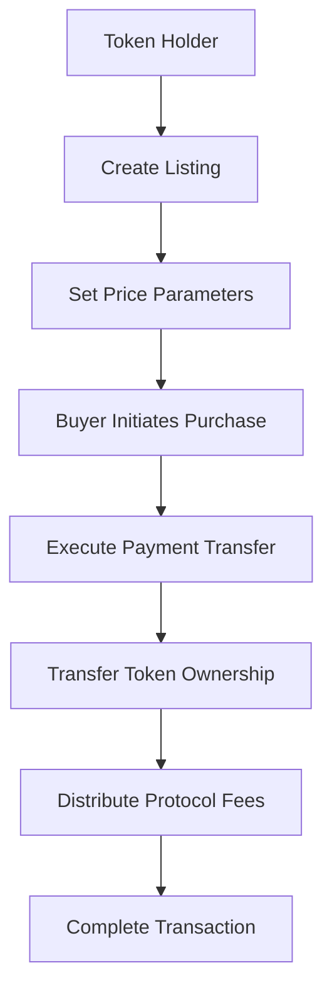
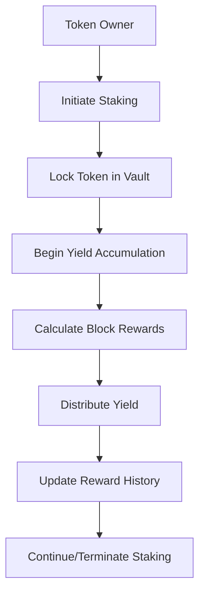

# BitVault Protocol

## Institutional-Grade Asset Tokenization on Bitcoin Layer 2

BitVault is a sophisticated DeFi protocol that leverages Bitcoin's unparalleled security through Stacks to create liquid, tradeable representations of real-world assets. Built for institutional investors, asset managers, and sophisticated retail participants, BitVault provides enterprise-grade custody solutions, automated yield generation, and advanced risk management capabilities.

---

## 🏗️ System Overview

BitVault transforms traditional asset management by providing a comprehensive infrastructure for tokenizing, securing, and trading real-world assets on Bitcoin's network. The protocol operates on Stacks, ensuring Bitcoin-level security while enabling sophisticated DeFi operations.

### Core Value Propositions

- **Bitcoin Security**: Leveraging Bitcoin's proven consensus mechanism for maximum security
- **Institutional Grade**: Enterprise-level custody and risk management features
- **Liquidity Optimization**: Instant global liquidity for traditionally illiquid assets
- **Yield Generation**: Automated staking mechanisms with optimized returns
- **Fractional Access**: Democratized access to premium asset classes through fractional ownership

---

## 🏛️ Contract Architecture

### Core Components

```
BitVault Protocol
├── Asset Tokenization Engine
├── Marketplace Infrastructure
├── Fractional Ownership System
├── Staking & Yield Optimization
├── Risk Management Layer
└── Data Query Interface
```

### Key Data Structures

#### 1. **Vault Tokens**

- **Primary Asset Registry**: Core tokenized asset information
- **Collateral Tracking**: Real-time collateralization monitoring
- **Staking Status**: Active yield generation tracking
- **Ownership Records**: Immutable ownership chain

#### 2. **Marketplace Listings**

- **Price Discovery**: Dynamic market pricing mechanisms
- **Seller Verification**: Authenticated seller information
- **Listing Status**: Active/inactive marketplace states

#### 3. **Fractional Ownership**

- **Share Distribution**: Granular ownership tracking
- **Transfer Mechanics**: Secure fractional share transfers
- **Voting Rights**: Proportional governance participation

#### 4. **Yield Tracking**

- **Reward Accumulation**: Automated yield calculations
- **Distribution History**: Comprehensive payout records
- **Performance Metrics**: Real-time yield analytics

---

## 🔄 Data Flow Architecture

### 1. Asset Tokenization Flow



### 2. Marketplace Transaction Flow



### 3. Staking & Yield Generation Flow



---

## 🔧 Technical Implementation

### Smart Contract Functions

#### Asset Management

- `mint-asset-token`: Create new tokenized assets with collateral backing
- `transfer-asset-token`: Secure ownership transfers with validation
- `get-vault-token-info`: Comprehensive asset information retrieval

#### Marketplace Operations

- `create-marketplace-listing`: Professional listing creation with pricing
- `execute-token-purchase`: Automated purchase execution with fee distribution
- `get-marketplace-listing`: Real-time listing status and pricing

#### Fractional Ownership

- `transfer-fractional-shares`: Granular share transfer capabilities
- `get-fractional-ownership-data`: Detailed ownership information

#### Staking & Yield

- `initiate-token-staking`: Begin automated yield generation
- `terminate-token-staking`: Secure staking termination with final rewards
- `calculate-accumulated-rewards`: Real-time yield calculations

### Security Features

#### Collateralization Requirements

- **Minimum Ratio**: 150% over-collateralization for risk mitigation
- **Dynamic Adjustment**: Real-time collateral monitoring
- **Liquidation Protection**: Automated risk management protocols

#### Access Control

- **Owner Verification**: Multi-layer ownership validation
- **Transfer Restrictions**: Secure transfer mechanisms
- **Staking Limitations**: Protected staking state management

---

## 🎯 Use Cases

### Institutional Applications

- **Real Estate**: Tokenize premium properties with instant global liquidity
- **Collectibles**: High-value art and collectibles with verified provenance
- **Infrastructure**: Debt instruments and revenue-generating assets
- **Commodities**: Commodity-backed financial instruments

### Retail Applications

- **Fractional Ownership**: Access to premium assets through fractional shares
- **Yield Generation**: Automated staking rewards for passive income
- **Portfolio Diversification**: Cross-asset exposure through tokenization

---

## 📊 Protocol Statistics

### Key Metrics Tracking

- **Total Tokens**: Global tokenization volume
- **Active Staking**: Real-time staking participation
- **Protocol Fees**: Revenue and sustainability metrics
- **Yield Rates**: Current and historical yield performance

### Risk Management

- **Collateral Ratios**: Dynamic risk assessment
- **Liquidation Thresholds**: Automated risk mitigation
- **Market Volatility**: Real-time volatility monitoring

---

## 🚀 Getting Started

### Prerequisites

- Stacks wallet with STX tokens for gas and collateral
- Asset documentation for tokenization
- Understanding of DeFi protocols and risk management

### Basic Operations

1. **Mint Asset Token**: Deposit collateral and create tokenized representation
2. **List on Marketplace**: Set pricing and enable trading
3. **Enable Staking**: Activate yield generation mechanisms
4. **Manage Fractional Shares**: Transfer and trade fractional ownership

---

## 🔒 Security Considerations

### Protocol Security

- **Bitcoin-Level Security**: Leveraging Bitcoin's proven consensus
- **Smart Contract Auditing**: Comprehensive security reviews
- **Collateral Management**: Over-collateralization requirements
- **Access Controls**: Multi-layer permission systems

### Risk Management

- **Liquidation Mechanisms**: Automated risk mitigation
- **Oracle Integration**: Real-time price feeds
- **Volatility Protection**: Dynamic risk adjustment
- **Emergency Procedures**: Protocol pause and recovery mechanisms

---

## 📈 Economic Model

### Fee Structure

- **Protocol Fees**: 2.5% marketplace transaction fees
- **Yield Distribution**: 7.5% annual yield for staking participants
- **Collateral Requirements**: 150% minimum collateralization ratio

### Tokenomics

- **Utility Token**: STX used for gas, collateral, and governance
- **Yield Generation**: Automated reward distribution
- **Fee Redistribution**: Protocol sustainability mechanisms

---

## 🤝 Contributing

BitVault is built for institutional adoption and community growth. We welcome contributions from:

- **Institutional Partners**: Asset managers and custody providers
- **Technical Contributors**: Smart contract developers and security auditors
- **Community Members**: DeFi enthusiasts and Bitcoin maximalists

---

## 📄 License

This project is licensed under the MIT License - promoting open-source development while maintaining institutional-grade standards.

---

## BitVault - Securing the Future of Digital Asset Management on Bitcoin
